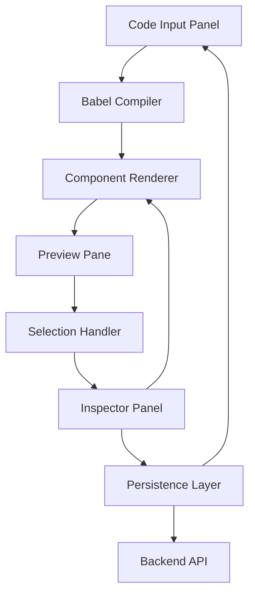
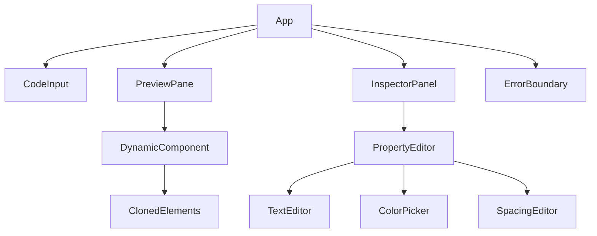

# Design Document

## Overview

The React Live Inspector is a single-page application built on React 19 and Vite that provides a live JSX playground with visual element selection and property editing capabilities. The application consists of three main areas: a code input panel, a live preview pane, and an inspector panel for editing selected elements.

The system uses client-side JSX compilation via @babel/standalone, custom element cloning for selection tracking, and a minimal backend API for persistence. The architecture prioritizes performance, security, and accessibility while maintaining a lightweight footprint.

## Architecture

### High-Level Architecture



### Component Hierarchy



## Components and Interfaces

### Core Components

#### 1. App Component

- **Purpose**: Main application container managing global state
- **State**:
  - `jsxCode: string` - Current JSX input
  - `compiledComponent: React.ComponentType | null` - Compiled React component
  - `selectedElement: ElementPath | null` - Currently selected element path
  - `elementProperties: ElementProperties` - Properties of selected element
  - `error: CompilationError | null` - Compilation or runtime errors

#### 2. CodeInput Component

- **Purpose**: JSX code input with syntax highlighting
- **Props**:
  - `value: string`
  - `onChange: (code: string) => void`
  - `onPreview: () => void`
- **Features**: Multiline textarea with basic syntax highlighting

#### 3. PreviewPane Component

- **Purpose**: Renders compiled JSX with selection capabilities
- **Props**:
  - `component: React.ComponentType | null`
  - `onElementSelect: (path: ElementPath) => void`
  - `selectedPath: ElementPath | null`
- **Features**: Element cloning with click handlers and visual highlighting

#### 4. InspectorPanel Component

- **Purpose**: Property editing interface for selected elements
- **Props**:
  - `selectedElement: ElementPath | null`
  - `properties: ElementProperties`
  - `onPropertyChange: (property: string, value: any) => void`
- **Features**: Dynamic form generation based on element type

### Data Models

#### ElementPath

```typescript
interface ElementPath {
  indices: number[];
  elementType: string;
  key?: string;
}
```

#### ElementProperties

```typescript
interface ElementProperties {
  textContent?: string;
  style: {
    color?: string;
    backgroundColor?: string;
    padding?: string;
    margin?: string;
    borderRadius?: string;
  };
}
```

#### CompilationError

```typescript
interface CompilationError {
  message: string;
  line?: number;
  column?: number;
  type: "syntax" | "runtime" | "babel";
}
```

### Core Services

#### 1. JSX Compiler Service

- **Purpose**: Client-side JSX compilation using @babel/standalone
- **Methods**:
  - `compileJSX(code: string): Promise<React.ComponentType>`
  - `validateJSX(code: string): CompilationError | null`
- **Configuration**: Uses preset-react with TypeScript support

#### 2. Element Cloning Service

- **Purpose**: Recursively clone React elements with selection handlers
- **Methods**:
  - `cloneWithHandlers(element: React.ReactElement, path: ElementPath): React.ReactElement`
  - `injectSelectionProps(element: React.ReactElement, path: ElementPath): React.ReactElement`
- **Features**: Adds data-path attributes and onClick handlers

#### 3. Property Extraction Service

- **Purpose**: Extract editable properties from selected elements
- **Methods**:
  - `extractProperties(element: React.ReactElement): ElementProperties`
  - `applyProperties(element: React.ReactElement, properties: ElementProperties): React.ReactElement`
- **Whitelist**: text content, color, backgroundColor, padding, margin, borderRadius

#### 4. Serialization Service

- **Purpose**: Convert component state to/from JSON for persistence
- **Methods**:
  - `serializeComponent(component: React.ComponentType, properties: ElementProperties[]): string`
  - `deserializeComponent(data: string): { component: React.ComponentType, properties: ElementProperties[] }`

## Data Models

### Component State Structure

```typescript
interface AppState {
  jsxCode: string;
  compiledComponent: React.ComponentType | null;
  selectedElement: ElementPath | null;
  elementProperties: Map<string, ElementProperties>;
  compilationError: CompilationError | null;
  isLoading: boolean;
  savedComponentId?: string;
}
```

### API Data Models

```typescript
interface SaveComponentRequest {
  code: string;
  properties: Record<string, ElementProperties>;
}

interface SaveComponentResponse {
  id: string;
  url: string;
}

interface LoadComponentResponse {
  code: string;
  properties: Record<string, ElementProperties>;
}
```

## Error Handling

### Compilation Errors

- **Babel Syntax Errors**: Display line/column information with syntax highlighting
- **Runtime Errors**: Catch with ErrorBoundary and display user-friendly messages
- **Invalid JSX**: Validate before compilation and show specific error types

### Selection Errors

- **Invalid Element Path**: Gracefully handle when selected element no longer exists
- **Property Application Failures**: Revert to previous state and show warning
- **Deep Nesting Issues**: Limit selection depth to prevent performance issues

### Network Errors

- **Save Failures**: Retry mechanism with exponential backoff
- **Load Failures**: Fallback to localStorage if available
- **Connection Issues**: Offline mode with local-only functionality

## Testing Strategy

### Unit Testing

- **Compiler Service**: Test JSX compilation with valid/invalid inputs
- **Element Cloning**: Verify proper handler injection and path generation
- **Property Extraction**: Test property extraction from various element types
- **Serialization**: Round-trip testing for component state persistence

### Integration Testing

- **Component Interaction**: Test selection → property editing → preview update flow
- **Error Boundaries**: Verify error handling across component boundaries
- **State Management**: Test state consistency during complex user interactions

### End-to-End Testing

- **User Workflows**: Complete user journeys from JSX input to save/share
- **Browser Compatibility**: Cross-browser testing on Chrome 95+, Firefox 90+, Safari 15+
- **Performance**: Measure compilation and rendering times under various loads
- **Accessibility**: Keyboard navigation and screen reader compatibility

### Performance Testing

- **Large Components**: Test with deeply nested JSX structures
- **Rapid Editing**: Measure response times during rapid property changes
- **Memory Usage**: Monitor for memory leaks during extended use
- **Bundle Size**: Ensure minimal impact on application load time

## Security Considerations

### Code Execution Safety

- **Babel Sandboxing**: Restrict Babel transforms to safe presets only
- **No Direct Eval**: Prevent arbitrary code execution outside Babel wrapper
- **Component Isolation**: Render user components in isolated context

### XSS Prevention

- **Input Sanitization**: Validate JSX input before compilation
- **Property Whitelisting**: Only allow editing of safe CSS properties
- **Content Security Policy**: Implement CSP headers to prevent script injection

### Data Validation

- **API Input Validation**: Validate all backend API inputs
- **Property Type Checking**: Ensure property values match expected types
- **Path Validation**: Validate element paths to prevent traversal attacks

## Performance Optimizations

### Compilation Optimization

- **Babel Caching**: Cache compiled components to avoid recompilation
- **Incremental Updates**: Only recompile when JSX code changes
- **Worker Threading**: Consider web workers for heavy compilation tasks

### Rendering Optimization

- **React.memo**: Memoize components that don't need frequent updates
- **Selective Re-rendering**: Only update affected elements when properties change
- **Virtual Scrolling**: For large component trees in preview pane

### State Management

- **Immutable Updates**: Use immutable state updates to optimize React rendering
- **Debounced Updates**: Debounce rapid property changes to reduce render cycles
- **Lazy Loading**: Load inspector panels only when elements are selected
